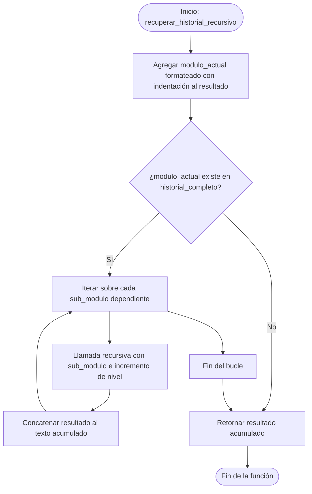

# Plataforma Educativa Personalizada

Este proyecto es una aplicación de escritorio interactiva desarrollada en **Python** utilizando **Tkinter**. Su objetivo es simular una plataforma de aprendizaje que incorpora conceptos clave de estructuras de datos y algoritmos de optimización para ofrecer sugerencias personalizadas, seguimiento de progreso y detección de cuellos de botella en la ruta de aprendizaje de los estudiantes.

El proyecto funciona de manera **completamente local**, utilizando un motor de base de datos persistente basado en archivos JSON.

---

## 🛠️ Tecnologías Utilizadas

- **Lenguaje:** Python 3.x
- **Interfaz Gráfica:** Tkinter / ttk (Librería estándar de Python)
- **Base de Datos:** Archivo JSON local (`db_local.json`)
- **Bibliotecas Estándar:** `os`, `json`, `random`

---

## ⚙️ Características y Estructuras del Proyecto

La aplicación demuestra la implementación de las siguientes estructuras de datos y algoritmos:

### 1. Motor de Base de Datos Local (`MotorBaseDatos`)
* **Propósito:** Persistencia de datos local sin dependencias en la nube (anteriormente Firebase).
* **Funcionamiento:** Carga y guarda información en `db_local.json`. Si el archivo no existe, lo inicializa con un listado predeterminado de cursos.

### 2. Estructura Lineal: Cola (`ColaProgreso`)
* **Propósito:** Simula la recolección de progresos en tiempo real mediante un flujo **FIFO** (First-In, First-Out / Primero en entrar, primero en salir).
* **Interacción:** El usuario puede "encolar" progresos aleatorios (actividad simulada) y luego "sincronizar" (desencolar) para guardar la información permanentemente en la base de datos local.

### 3. Estructura No Lineal: Grafo (`GrafoRendimiento`)
* **Propósito:** Modelar las rutas de los cursos como nodos y transiciones entre módulos para detectar posibles patrones de deserción o abandono escolar.
* **Algoritmo:** Evalúa si las tasas de abandono entre dos módulos adyacentes superan un umbral configurable (por defecto, >50%) para alertar sobre cuellos de botella académicos.

### 4. Algoritmo de Ordenamiento: Quick Sort (`quicksort_cursos`)
* **Propósito:** Ordenar las sugerencias de cursos para el estudiante.
* **Funcionamiento:** Ordena el arreglo de cursos de manera descendente según su índice de **relevancia** (mayor relevancia primero).

### 5. Algoritmo de Búsqueda: Búsqueda Binaria (`busqueda_binaria_curso`)
* **Propósito:** Buscar un curso específico dentro de la base de datos a partir de su identificador numérico único (ID).
* **Funcionamiento:** Ordena la lista de cursos ascendentemente por ID antes de realizar la búsqueda binaria clásica de complejidad temporal $O(\log n)$.

### 6. Recursividad (`recuperar_historial_recursivo`)
* **Propósito:** Reconstruir y visualizar el historial de módulos completados del estudiante en base a sus relaciones jerárquicas o prerrequisitos de aprendizaje.
* **Funcionamiento:** Recorre de forma recursiva un árbol de dependencias para generar una representación formateada de la ruta completada.

---

## 📊 Diagrama de Flujo y Pseudocódigo: Recuperación de Historial Recursivo

Este módulo recupera de forma jerárquica el historial de módulos completados y prerrequisitos del estudiante usando recursividad.

### Diagrama de Flujo (Mermaid)



### Pseudocódigo

```text
Función recuperar_historial_recursivo(modulo_actual, historial_completo, nivel)
    resultado = (Espacios según nivel) + "- Módulo Completado: " + modulo_actual + salto_de_linea
    
    Si modulo_actual existe en las llaves de historial_completo Entonces
        Para cada sub_modulo en historial_completo[modulo_actual] Hacer
            resultado = resultado + recuperar_historial_recursivo(sub_modulo, historial_completo, nivel + 1)
        Fin Para
    Fin Si
    
    Retornar resultado
Fin Función
```

---

## 📂 Estructura de Archivos

```bash
plataforma_aprendizaje/
│
├── index.py          # Script principal con la lógica de negocio y la interfaz Tkinter
├── db_local.json     # Base de datos local persistente (se genera automáticamente al iniciar)
├── README.md         # Documentación del proyecto
└── .gitattributes    # Atributos de Git para el manejo del repositorio
```

---

## 🚀 Instrucciones de Uso y Ejecución

### Requisitos Previos

- Tener instalado **Python 3.x** en tu sistema.

### Ejecución de la Aplicación

Para iniciar la plataforma de aprendizaje, abre tu consola/terminal en la carpeta raíz del proyecto y ejecuta:

```bash
python index.py
```

### Guía de la Interfaz de Usuario

Una vez que se abre la aplicación, encontrarás cuatro pestañas organizadas según la funcionalidad:

1. **Cursos (Orden/Búsqueda):**
   - Haz clic en *Cargar y Ordenar por Relevancia* para ver la lista de cursos ordenada mediante Quick Sort.
   - Introduce un ID numérico en la casilla de búsqueda y presiona *Buscar* para localizar el curso usando Búsqueda Binaria.

2. **Progreso (Cola/Lineal):**
   - Presiona *Simular Actividad (Encolar)* para agregar progresos a la cola en memoria.
   - Presiona *Sincronizar a BD (Desencolar)* para persistir los progresos de la cola en el archivo `db_local.json`.

3. **Análisis (Grafo/No Lineal):**
   - Haz clic en *Analizar Cuellos de Botella* para evaluar las tasas de abandono entre los módulos del curso y generar alertas automáticas del grafo.

4. **Historial (Recursividad):**
   - Presiona *Generar Árbol de Módulos Completados* para visualizar la reconstrucción de prerrequisitos usando recursividad.

---

## 🧠 Conclusiones: Importancia de Múltiples Estructuras en el Desarrollo de Software Inteligente

El diseño y desarrollo de software moderno y con capacidades "inteligentes" (como recomendación personalizada, análisis predictivo o simulación de flujos en tiempo real) requiere la combinación estratégica de múltiples estructuras de datos y algoritmos. A continuación se presentan las conclusiones clave de esta aproximación:

### 1. Optimización del Rendimiento (Complejidad Temporal y Espacial)
No existe una estructura de datos universalmente óptima. 
- Para la ingesta rápida y ordenada en tiempo real, una **estructura lineal como la Cola (FIFO)** ofrece inserciones y remociones eficientes en tiempo constante $O(1)$.
- Para realizar búsquedas sobre volúmenes de datos masivos, una estructura lineal no ordenada requeriría una búsqueda secuencial de $O(n)$, mientras que al combinar **Quick Sort** y **Búsqueda Binaria** se logra reducir el tiempo a $O(\log n)$.

### 2. Modelado Fiel de Problemas Complejos
El mundo real no es unidimensional. El software inteligente debe resolver problemas cuyas relaciones internas son complejas:
- Las dependencias académicas y prerrequisitos de los cursos forman naturalmente una estructura de **Árbol (Jerarquía)**, la cual se explora de manera elegante mediante algoritmos **Recursivos**.
- Los patrones de deserción, interacción social o rutas de navegación web son redes interconectadas que no pueden modelarse con listas o colas; requieren de **Grafos** (estructuras no lineales) para calcular caminos críticos, distancias de red y detectar cuellos de botella mediante aristas ponderadas.

### 3. Escalabilidad y Modularidad
El desacoplamiento de funciones (donde un componente filtra datos, otro los analiza como grafo y otro los encola para persistencia) permite diseñar sistemas altamente modulares. Cambiar la persistencia local (de un archivo JSON a una base de datos distribuida, por ejemplo) es sumamente sencillo porque la interfaz del motor de datos está bien delimitada y es independiente de las estructuras que consumen los algoritmos principales.

En resumen, la aplicación de múltiples estructuras de datos dota al software de la **versatilidad** y la **eficiencia** necesarias para procesar, organizar y razonar sobre la información de manera inteligente, sentando las bases para sistemas robustos capaces de escalar en entornos reales.

